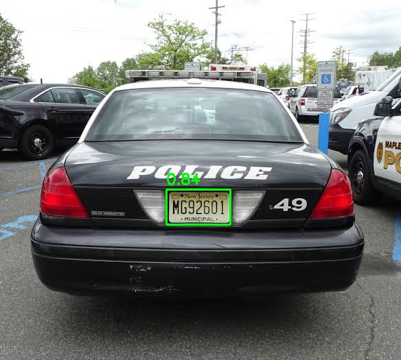
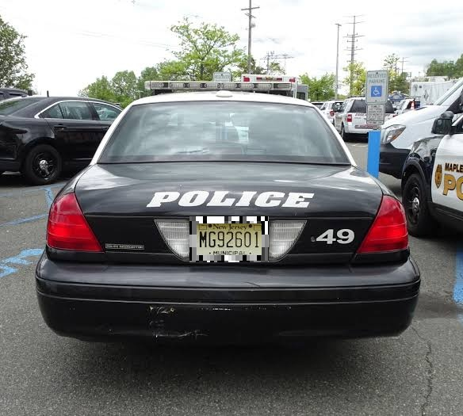

# scarecrow

Adversarial frame pattern optimization for evading automated license plate recognition. Given a photo of your plate, scarecrow generates a printable grayscale pattern that suppresses detection while keeping the plate readable to humans.

[Keeps the flock away.](https://www.eff.org/deeplinks/2025/12/effs-investigations-expose-flock-safetys-surveillance-abuses-2025-review)

> [!WARNING]
> This project is a research tool for exploring adversarial robustness and personal privacy against warrantless mass surveillance. It is not intended for evading law enforcement in the commission of a crime. Frame patterns do not obstruct or alter plate text, but laws around plate-adjacent devices vary by jurisdiction and are evolving. Florida (F.S. 320.262, eff. Oct 2025) and California (Vehicle Code 5201(d), eff. Jan 2026) have broad statutes targeting devices that interfere with electronic recognition of plates. Check your local laws before use.

## Why

Flock Safety and other ALPR cameras are in thousands of neighborhoods, parking lots, and police networks across the US. They capture and index every plate that passes, feeding a searchable surveillance database with no warrant, no notification, and in most cases no public oversight.

A system that can track anyone, anywhere, with no transparency or accountability is [fundamentally immoral](https://philzimmermann.com/EN/essays/WhyIWrotePGP.html). This project is my way of exploring what can be done about it.

Inspired by Ben Jordan's [PlateShapez](https://github.com/bennjordan/PlateShapez) and his investigations into Flock Safety. Where his approach uses random geometric perturbations on the plate, scarecrow uses gradient-based optimization of a frame pattern around it, aiming to be more robust and legally viable since the plate itself is never altered.

## How It Works

Scarecrow optimizes a grayscale frame pattern using gradient descent against a YOLO plate detection model. The pattern sits in the border region around the plate, inside a printable frame, and is tuned to minimize the detector's confidence on your specific plate.

To keep the pattern from overfitting to the reference photo, each optimization step applies random augmentations that simulate what a camera might actually see:

- **Rotation and perspective warp** to simulate different viewing angles
- **Brightness and contrast shifts** for varying lighting and IR illumination
- **Gaussian blur** for distance and motion
- **Additive noise** for sensor noise
- **Scale jitter** for varying camera distance

Flock and most ALPR cameras are rear-facing, [mounted at 8 to 12 feet](https://www.flocksafety.com/implementation-guide), so the viewing geometry is fairly constrained. The augmentation ranges were chosen with this in mind: rotation stays within 10 degrees, perspective within 20 to 25 degrees, and scale varies from 0.5x to 1.2x to cover plates captured at different distances from the camera.

This is Expectation over Transformation (EoT). The loss function uses logsumexp to upweight the hardest samples, so the optimization focuses on conditions where the pattern is weakest.

The included detection model is a [YOLO11n](https://huggingface.co/morsetechlab/yolov11-license-plate-detection) plate detector exported via `torch.export`. If you're targeting a different detector, see [Using your own detection model](#using-your-own-detection-model) below.

## Results

On the included test plate, scarecrow drops detection confidence from 0.84 to 0.00 (full evasion) in 1000 steps, and the plate remains human-readable.

| Before | After |
|---|---|
|  |  |

OCR is sometimes corrupted as a side effect, though it's not entirely clear why. The frame pattern doesn't touch the plate text, but it may bleed into the surrounding region some models use as context. To my knowledge, Flock's on-device model detects vehicles, not just plates, so the image likely gets uploaded regardless and OCR runs separately in the cloud. Adding OCR corruption directly to the loss function is planned but not yet implemented.

## Usage

Requires Python 3.11+. A CUDA GPU is recommended but not required, as optimization also works on CPU (slower).

Install dependencies:

```bash
uv sync
```

Take a photo of your plate from the front, straight on, with even lighting and minimal angle. This is the reference image the optimization works from. See `test_plate.jpg` for an example.

```bash
# Optimize a frame pattern for your plate (takes a few minutes on GPU)
scarecrow optimize plate.jpg

# Preview the result
scarecrow apply plate.jpg --pattern pattern.png

# Evaluate detection evasion
scarecrow eval plate.jpg --pattern pattern.png

# Evaluate OCR corruption (requires rapidocr: uv sync --extra ocr)
scarecrow eval plate.jpg --pattern pattern.png --ocr
```

## Using your own detection model

Scarecrow works with any plate detection model, not just the included YOLO11n. The model needs to be in `torch.export` format (`.pt2`).

If you have ultralytics `.pt` weights, you can convert them like this:

```bash
uv run --with ultralytics python3 -c "
import torch; from ultralytics import YOLO
m = YOLO('your-model.pt').model.eval()
for p in m.parameters(): p.requires_grad_(False)
ep = torch.export.export(m, (torch.randn(1, 3, 640, 640),))
torch.export.save(ep, 'your-model.pt2')
"
```

Then pass `--weights your-model.pt2` to any scarecrow command.

## Limitations

I haven't tested this against a real ALPR camera. So far the optimization has only run in simulation against rendered composites. If you have access to Flock or other ALPR hardware and can benchmark, I'd love to hear how it performs.

The included model is a single YOLO11n plate detector. Adversarial patterns can transfer across similar architectures, but how well they transfer to other detectors (including Flock Safety's proprietary YOLO variant) is untested.

## License

GPL-3.0. See [LICENSE](LICENSE).
